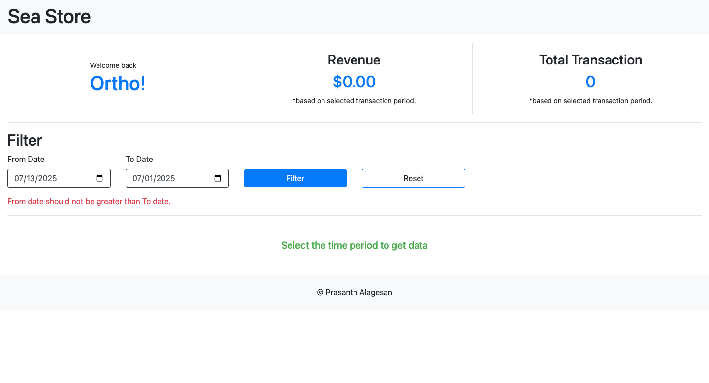
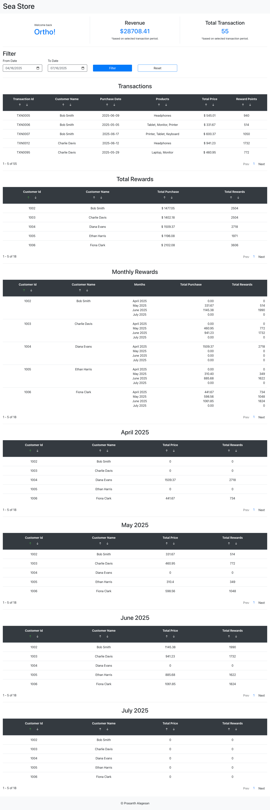
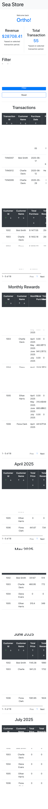

# React + Vite
A **single-page** React application that simulates a **Customer Rewards** program for a retailer.

# Feature
- Calculate reward points<br/>
    - 2 points for every $1 spent over $100<br/>
    - 1 point for every $1 spent between $50 and $100<br/>
- Monthly reward points breakdown<br/>
- Transactions list with rewards per transaction<br/>
- Implemented filter to retrieve timeline-based transaction data.<br/>
- Custom pagination for tables<br/>
- Total rewards per customer<br/>
- Implemented a loading spinner for a smoother and more seamless user experience on API calls(Promises)<br/>
- Searching and sorting (asc|desc) on transaction records<br/>
- Error boundaries for UI fallback<br/>
- Optimized view for all screen sizes (responsive design)<br/>

# Installation
git clone https://github.com/Sriprasanth8/customer-rewards.git<br/>
cd customer-rewards<br/>
npm i<br/>
npm run dev<br/>

# UI
Build - React version(16+)<br/>
Style - Bootstrap, CSS<br/>
API - Axios<br/>
Testing - Manual Testing<br/>

# Sample dataset
I'm using Axios and josn file to simulate real world API calls.<br/>
I have create a sample JSON dataset for API response simulation.<br/>

Transaction API response<br/>
```json
[
  {
    "transactionID" : "string",
    "customerId": "string",
    "customerName": "string",
    "purchaseDate": "yyyy-mm-dd",
    "product" : "string",
    "totalPrice" : "number"
  }
]
```

# Directory structure
```bash
customer-rewards/
├── public/
│   └── json/
├── src/
│   ├── assets/
│   ├── components/
│   ├── errorHandler/
│   ├── screens/
│   │   └── dashBoard/sections/
│   ├── services/
│   ├── utils/
│   ├── App.css
│   ├── App.jsx
│   └── main.jsx
├── index.html
├── eslint-report.json
├── package.json
├── README.md
├── Unit_Test_Script.txt
└── vite.config.js
```

# Author
> Prasanth Alagesan

# UI
Retailer dashboard


Date validation


Transaction table with filtering & sorting options


Fallback UI for Error


No data with the specific timeline


Mobile Views<br/>

